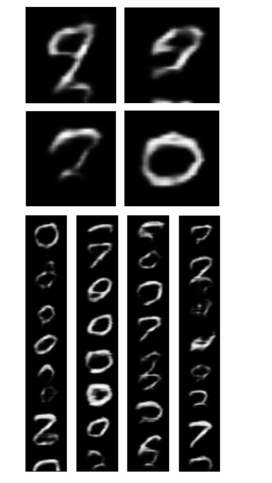

 VariationalRecurrentNeuralNetwork
Pytorch implementation of the Variational RNN (VRNN), from *A Recurrent Latent Variable Model for Sequent$
The paper is available [here](https://arxiv.org/abs/1506.02216).

## Run:

To train: ``` python train.py ```


To sample with saved model: ``` python sample [saves/saved_state_dict_name.pth]```

## Some samples:


